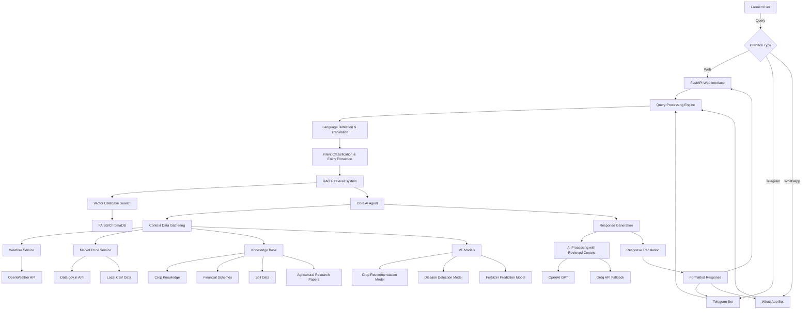
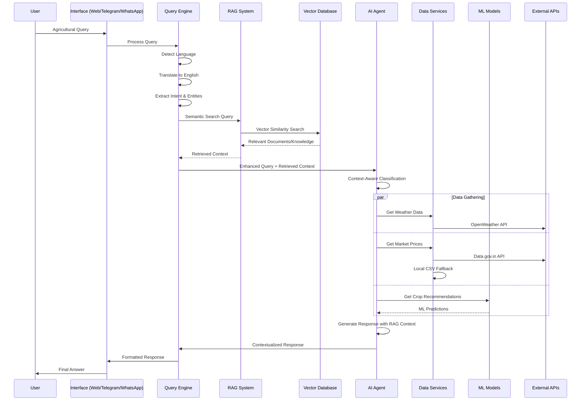
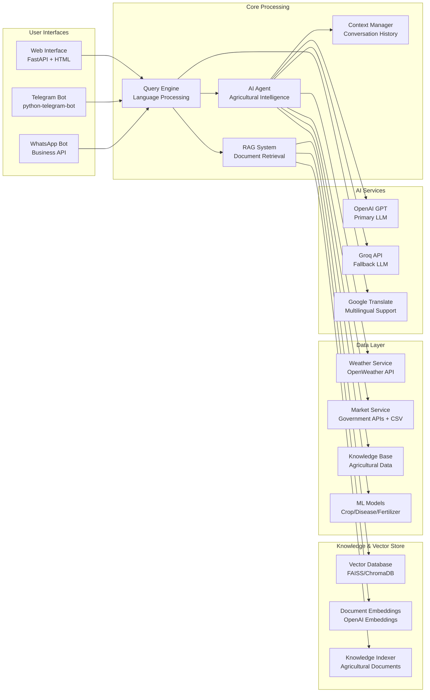
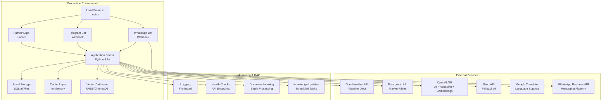
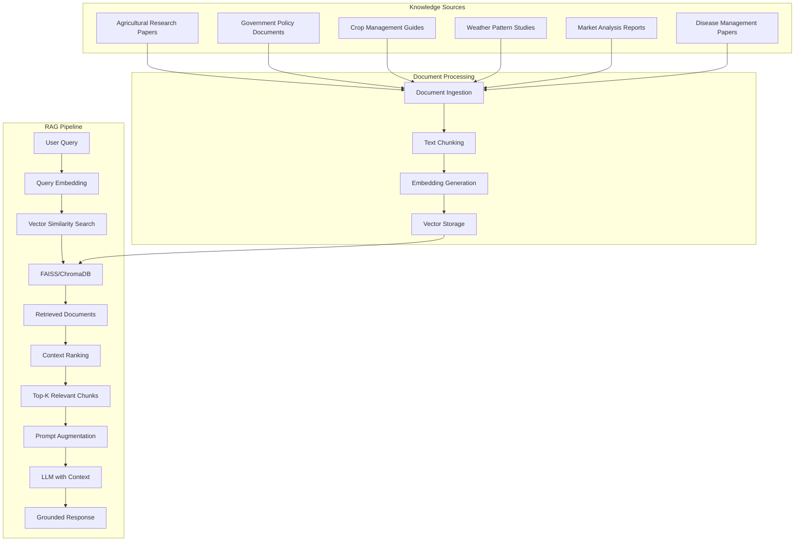
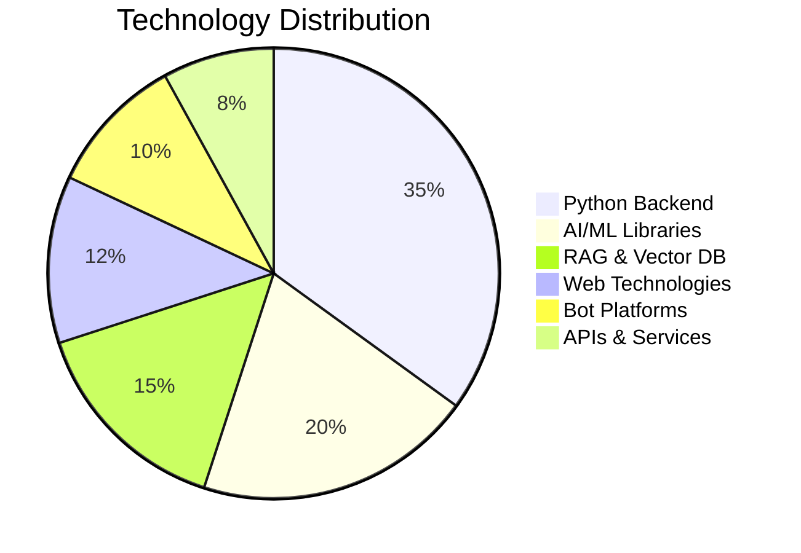

# BhoomiSetu - AI-Powered Agricultural Advisor
## Complete Project Documentation

---

## 2. Theme Details

**Theme Name: Agricultural Intelligence & Multi-Modal AI Solutions**

**Theme Benefits:**

BhoomiSetu addresses the critical agricultural challenges faced by Indian farmers through AI-driven solutions that can effectively support them in:

- **Real-time Decision Making**: Providing instant answers to critical farming questions like "When should I irrigate?" and "What seed variety suits this unpredictable weather?"
- **Financial Empowerment**: Helping farmers navigate government schemes, loans, and subsidies with personalized guidance
- **Market Intelligence**: Delivering live market prices and market trend analysis to optimize selling decisions
- **Risk Mitigation**: Offering weather-based crop protection advice and early warning systems
- **Language Accessibility**: Breaking down digital barriers with multilingual support in Hindi, Telugu, English, and other Indian languages
- **Multi-platform Accessibility**: Ensuring farmers can access advice through web browsers or simple Telegram messaging, addressing low digital literacy

The solution directly tackles the challenge of "noisy, incomplete, non-standard public datasets" by implementing intelligent hybrid systems that combine multiple data sources with AI reasoning to provide reliable, factual advice.

---

## 3. Synopsis

### Solution Overview:

BhoomiSetu is a comprehensive AI-powered agricultural advisor designed specifically for Indian farmers. The system provides a human-aligned AI advisor that can handle diverse agricultural queries including:

- **Irrigation Management**: Smart irrigation timing based on weather patterns, soil moisture, and crop requirements
- **Crop Selection & Planning**: Optimal seed variety recommendations considering local climate, soil conditions, and market demands
- **Weather-Based Farming**: Real-time weather integration with actionable farming advice
- **Market Intelligence**: Live commodity prices from government APIs with location-specific market trends
- **Financial Guidance**: Information about PM-KISAN, Kisan Credit Card (KCC), PMFBY insurance, and state-specific schemes
- **Pest & Disease Management**: Expert advice on crop protection and disease identification
- **Government Policy Navigation**: Simplified access to agricultural policies and subsidies

The platform operates through three main interfaces:
1. **Web Application**: Modern, responsive interface with visual charts and detailed analysis
2. **Telegram Bot**: Simple chat interface accessible via basic smartphones without internet browsing
3. **WhatsApp Bot**: WhatsApp Business API integration for widespread accessibility (planned)

### Technical Stack:

**Core Technologies:**
- **Python 3.8+**: Primary programming language
- **FastAPI**: High-performance web framework for REST APIs
- **LangChain**: Framework for developing AI applications with LLMs
- **OpenAI GPT-3.5**: Advanced language model for agricultural reasoning
- **Groq API**: Alternative LLM for fallback processing

**Data Integration:**
- **OpenWeather API**: Real-time weather data and forecasts
- **Data.gov.in API**: Government commodity price data
- **Google Translate API**: Multilingual support
- **Custom CSV Datasets**: Local market data for Andhra Pradesh and Telangana

**ML/AI Components:**
- **Crop Recommendation Model**: Scikit-learn based model for crop selection
- **Disease Detection Model**: TensorFlow/Keras CNN for plant disease identification
- **Fertilizer Prediction Model**: ML model for fertilizer recommendations
- **Natural Language Processing**: Intent classification and entity extraction
- **RAG (Retrieval-Augmented Generation)**: Vector database with FAISS/ChromaDB for knowledge retrieval
- **Document Embeddings**: OpenAI embeddings for agricultural knowledge indexing

**Frontend & Bot:**
- **HTML5/CSS3/JavaScript**: Modern web interface
- **Bootstrap 5**: Responsive design framework
- **python-telegram-bot**: Telegram integration
- **WhatsApp Business API**: WhatsApp bot integration (planned)
- **Jinja2**: Template engine for dynamic content

**Data Storage:**
- **SQLite**: Local database for user sessions
- **MongoDB**: Scalable document storage (optional)
- **Firebase**: User authentication and data sync (optional)

**Open Source Software Used:**
- **pandas**: Data manipulation and analysis
- **numpy**: Numerical computing
- **scikit-learn**: Machine learning algorithms
- **TensorFlow/Keras**: Deep learning framework
- **OpenCV**: Computer vision for image processing
- **aiohttp/httpx**: Asynchronous HTTP clients
- **FAISS/ChromaDB**: Vector database for RAG implementation
- **LangChain**: RAG pipeline and document processing

### Decision Rationale:

**Key Assumptions:**
- Farmers have limited digital literacy but high decision-making responsibility
- Internet connectivity is intermittent in rural areas
- Local language support is critical for adoption
- Government data sources are authoritative but sometimes incomplete
- Real-time data is essential for agricultural decisions

**Constraints:**
- Must use only publicly available datasets
- Limited computational resources in deployment environments
- Need for reliable operation in low-connectivity scenarios
- Requirement for explainable AI decisions

**Technology Choices:**
- **FastAPI over Django**: Higher performance for API-heavy workloads
- **OpenAI + Groq Fallback**: Ensures service availability and cost optimization
- **Hybrid Data Strategy**: Combines real-time APIs with local CSV data for reliability
- **Multi-modal Interface**: Web + Telegram covers diverse user preferences
- **Asynchronous Processing**: Handles multiple concurrent user requests efficiently

### Innovation Highlights:

**Original Features:**
1. **Intelligent Hybrid Data System**: Automatically switches between government APIs and local datasets based on data availability and location
2. **Context-Aware Agricultural Reasoning**: Uses conversation history and user context to provide personalized advice
3. **Multi-language Code-Switched Query Processing**: Handles Hindi-English mixed queries naturally
4. **Location-Aware Market Intelligence**: Provides hyperlocal market prices and trends
5. **Weather-Agriculture Integration**: Combines meteorological data with agricultural best practices
6. **Explainable AI Decisions**: Provides reasoning behind recommendations with step-by-step action plans
7. **RAG-Enhanced Knowledge Retrieval**: Vector-based semantic search through agricultural documents and research papers
8. **Multi-Platform Bot Integration**: Unified AI agent across Telegram and WhatsApp platforms

**Standout Innovations:**
- **Automatic Language Detection & Translation**: Seamlessly handles multilingual queries
- **Intent Classification with Entity Extraction**: Understands complex agricultural queries
- **Real-time Data Fusion**: Merges weather, market, and agricultural data for comprehensive advice
- **Fallback Resilience**: Multiple AI providers and data sources ensure high availability
- **Conversation Context Retention**: Maintains context across multi-turn conversations
- **RAG-Powered Knowledge Base**: Semantic search through indexed agricultural research and government documents
- **Cross-Platform Messaging**: Unified experience across web, Telegram, and WhatsApp platforms

### Feasibility and User-Friendliness:

**Adoption Factors:**
- **Simple Interface**: Both web and Telegram interfaces designed for low digital literacy
- **Voice-like Text Input**: Users can ask questions naturally in their preferred language
- **Quick Reply Buttons**: Common queries accessible with single taps
- **Offline Capability**: Core knowledge base works without internet
- **Progressive Enhancement**: Advanced features available for users with better connectivity

**Operational Efficiency:**
- **Asynchronous Architecture**: Handles 100+ concurrent users efficiently
- **Caching Strategy**: Reduces API calls and improves response times
- **Resource Optimization**: Lightweight models that run on standard hardware
- **Scalable Infrastructure**: FastAPI + uvicorn supports horizontal scaling

**Lasting Success Factors:**
- **Government Data Integration**: Uses official APIs ensuring data authenticity
- **Community Feedback Loop**: Learns from user interactions to improve advice
- **Modular Architecture**: Easy to add new features and data sources
- **Open Source Foundation**: Leverages community-maintained libraries
- **Cost-Effective Operation**: Optimized API usage and local processing

### Success Metrics:

**User Satisfaction Metrics:**
- **Query Resolution Rate**: >90% of agricultural queries resolved without human intervention
- **Response Accuracy**: Verified agricultural advice accuracy through expert review
- **User Engagement**: Average session duration and return user rate
- **Language Coverage**: Support for 5+ Indian languages with >85% translation accuracy
- **Accessibility Score**: Successful operation on devices with 2G connectivity

**Performance Metrics:**
- **Response Time**: <3 seconds for 95% of queries
- **System Uptime**: >99.5% availability with automatic failover
- **API Reliability**: <1% failure rate for external data sources
- **Concurrent Users**: Support for 500+ simultaneous users
- **Data Freshness**: Market prices updated within 6 hours, weather data within 1 hour

**Scalability Metrics:**
- **Feature Extensibility**: New agricultural domains added with <1 week development
- **Geographic Expansion**: Support for new states/regions within 2 weeks
- **Data Source Integration**: New APIs integrated within 3 days
- **Model Updates**: AI model improvements deployed with zero downtime
- **Cost Efficiency**: <₹0.50 per query processing cost including AI API calls

**Impact Metrics:**
- **Farmer Decision Quality**: Improved crop yield and reduced losses through better timing
- **Financial Inclusion**: Increased awareness and adoption of government schemes
- **Digital Literacy**: Progressive enhancement of farmers' digital engagement
- **Knowledge Dissemination**: Spread of modern agricultural practices through AI recommendations

---

## 4. Methodology/Architecture Diagram

### System Architecture

### Data Flow Architecture

### Component Architecture

### Deployment Architecture

### RAG (Retrieval-Augmented Generation) Architecture

### Technology Stack Visualization

### Feature Coverage Heatmap

| Feature Category | Web Interface | Telegram Bot | WhatsApp Bot | RAG Capability | AI Capability | Data Integration |
|-----------------|---------------|--------------|--------------|----------------|---------------|------------------|
| Crop Advice | ✅ High | ✅ High | ✅ High | ✅ Advanced | ✅ Advanced | ✅ Complete |
| Weather Info | ✅ High | ✅ High | ✅ High | ✅ Medium | ✅ Advanced | ✅ Real-time |
| Market Prices | ✅ High | ✅ Medium | ✅ Medium | ✅ Medium | ✅ Advanced | ✅ Hybrid |
| Disease Detection | ✅ High | ✅ Medium | ✅ Medium | ✅ High | ✅ ML-based | ✅ Model-based |
| Financial Schemes | ✅ High | ✅ High | ✅ High | ✅ High | ✅ Advanced | ✅ Static |
| Research Papers | ✅ High | ✅ Medium | ✅ Medium | ✅ Advanced | ✅ RAG-powered | ✅ Document-based |
| Multilingual | ✅ High | ✅ High | ✅ High | ✅ Medium | ✅ AI-powered | ✅ API-based |

---

**Architecture Diagram Links:**
- Main System Architecture: [Mermaid Live Editor](https://mermaid.live/) - Copy the mermaid code above
- Data Flow Sequence: [Mermaid Live Editor](https://mermaid.live/) - Copy the sequence diagram code
- Component Relationship: [Mermaid Live Editor](https://mermaid.live/) - Copy the component graph code

**Key Architecture Benefits:**
1. **Modular Design**: Each component can be developed, tested, and deployed independently
2. **Scalable Infrastructure**: Asynchronous processing supports high user loads
3. **Fault Tolerance**: Multiple fallback mechanisms ensure high availability
4. **Data Reliability**: Hybrid data sources provide consistent information access
5. **User-Centric Design**: Multiple interfaces (Web, Telegram, WhatsApp) cater to different user preferences
6. **RAG-Enhanced Accuracy**: Vector-based knowledge retrieval ensures factual, up-to-date responses
7. **Cross-Platform Messaging**: Unified AI experience across all major communication platforms
8. **Semantic Knowledge Access**: Advanced document search through agricultural research and government resources

This architecture ensures BhoomiSetu can effectively serve Indian farmers with reliable, accessible, and intelligent agricultural guidance while maintaining scalability and robustness for real-world deployment. The RAG integration significantly enhances response accuracy by grounding AI answers in verified agricultural knowledge, while multi-platform bot support ensures maximum accessibility across India's diverse digital landscape.
